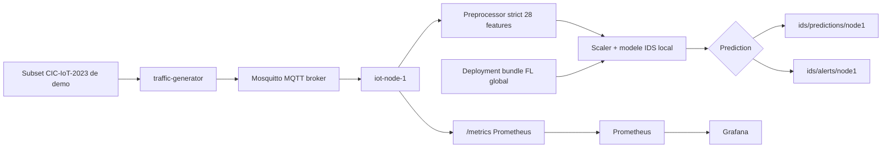
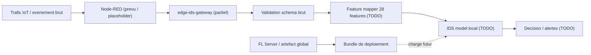
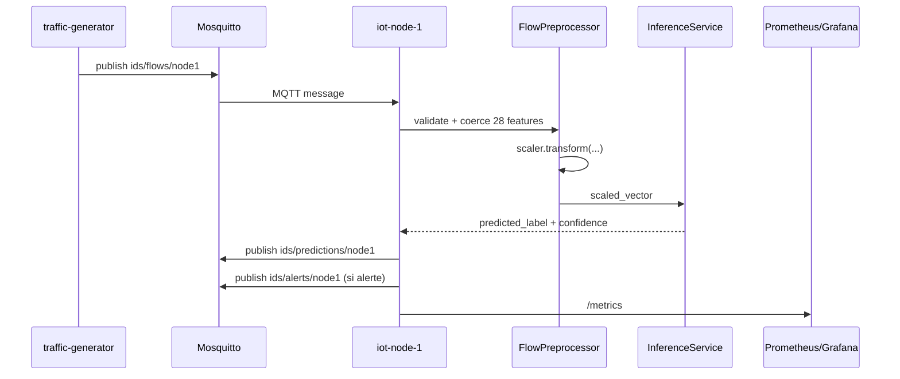
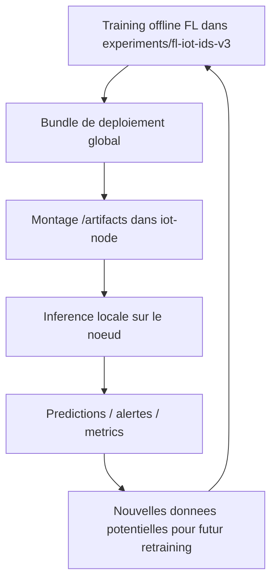

# Latest System Map - qi-fl-ids-iot

## 1. Vue globale

Le repository ne contient plus seulement un pipeline FL offline pour l'evaluation scientifique. Il contient maintenant deux couches qui coexistent:

- une couche **scientifique/offline** centree sur `experiments/fl-iot-ids-v3`
- une couche **microservices/online** centree sur `services/`

Point important apres audit: la **chaine online reellement executable aujourd'hui** n'est pas encore `Node-RED -> edge-ids-gateway -> inference`. La chaine validee dans le code et dans `services/docker-compose.yml` est:

```text
traffic-generator -> Mosquitto -> iot-node-1 -> predictions/alerts -> Prometheus/Grafana
```

Le dossier `services/edge-ids-gateway/` prepare une future gateway edge plus proche d'une entree IoT brute, mais il n'est pas encore branche a Docker Compose et n'execute pas encore le mapping 28 features ni l'inference locale.

Carte rapide du repository actuelle:

```text
qi-fl-ids-iot/
|-- data/
|-- docs/
|   |-- repository_map_fr.md
|   `-- latest_system_map.md
|-- experiments/
|   `-- fl-iot-ids-v3/
|       |-- configs/
|       |-- outputs/
|       |   `-- deployment/
|       |       `-- baseline_fedavg_normal_classweights/
|       |-- src/
|       `-- tests/
|-- outputs/
|   `-- mlruns/
|-- services/
|   |-- docker-compose.yml
|   |-- edge-ids-gateway/
|   |-- fl-client/
|   |-- fl-server/
|   |-- iot-node/
|   |-- monitoring/
|   |-- mosquitto/
|   |-- node-red/
|   |-- qga-service/
|   |-- scripts/
|   `-- traffic-generator/
|-- shared/
`-- README.md
```

Lecture simple:

- `experiments/fl-iot-ids-v3/` reste le coeur de l'entrainement FL, des scenarios non-IID et des artefacts.
- `services/` est la couche de demonstration/deploiement realiste.
- `services/iot-node/` est aujourd'hui le vrai service IDS online.
- `services/edge-ids-gateway/` est un futur service de gateway edge, encore partiel.
- `services/node-red/` existe comme profile d'orchestration, mais reste placeholder.

## 2. Pourquoi cette nouvelle architecture existe

Le pipeline FL historique est excellent pour entrainer, evaluer et comparer des strategies sur CICIoT2023, mais il reste principalement un pipeline **batch/offline**. Pour une demo deployable, il faut une chaine capable de recevoir des evenements reseau, d'executer l'inference localement et de publier des resultats en continu.

Cette evolution explique les nouveaux services:

- `Mosquitto` apporte un bus MQTT simple pour relier producteurs et consommateurs de flux.
- `traffic-generator` rejoue des subsets CIC-IoT-2023 sous forme de messages MQTT pour simuler le trafic.
- `iot-node` charge le bundle de modele global et fait l'inference locale sur le noeud.
- `Prometheus` et `Grafana` rendent la demo observable.
- `fl-server` et `fl-client` separent la phase d'entrainement FL de la phase d'inference temps reel.

Node-RED est introduit pour une architecture future plus proche du terrain: il pourrait jouer le role de point d'entree reseau/IoT, de normalisation ou d'orchestration de scenarios. Mais apres audit, **Node-RED n'est pas encore dans le flux de donnees principal**:

- `services/node-red/flows.json` est vide
- `services/node-red/README.md` declare explicitement un placeholder
- le profile Compose `orchestration` demarre un conteneur Node-RED, mais sans logique metier versionnee dans le depot

Le besoin d'une gateway IDS edge est egalement clair: `iot-node` attend aujourd'hui directement un payload deja converti en **28 features**. Or, un systeme IoT reel recoit plutot des evenements bruts. `edge-ids-gateway` est justement le service qui doit, a terme:

- recevoir un evenement brut
- valider son schema
- le convertir vers l'espace 28 features
- appliquer scaler + modele global
- publier la decision

La difference essentielle est donc:

- **FL training**: entraine et agrege un modele global
- **inference temps reel**: charge ce modele global sur un noeud et prend des decisions sur chaque flux

## 3. Architecture actuelle reelle

### 3.1 Pipeline online actuellement valide

Le flux online reellement implemente et documente par le code est:



### 3.2 Architecture cible partiellement introduite

Le repository contient deja les pieces d'une architecture plus realiste, mais elle n'est pas encore integree de bout en bout:



### 3.3 Ce que Docker Compose connecte vraiment

`services/docker-compose.yml` connecte actuellement:

- `mosquitto`
- `iot-node-1`
- `traffic-generator`
- `prometheus`
- `grafana`
- `mlflow`
- profile `training`: `fl-server`, `fl-client-1`, `fl-client-2`, `fl-client-3`
- profile `orchestration`: `node-red`
- profile `preprocessing`: `qga-service`

Point d'attention:

- `edge-ids-gateway` a un `Dockerfile`, mais **n'apparait pas dans `services/docker-compose.yml`**
- `iot-node-2` et `iot-node-3` sont explicitement notes comme futurs services dans le compose

## 4. Difference entre pipeline offline et pipeline online

| Aspect | Pipeline offline FL | Pipeline online IDS |
|---|---|---|
| Source de donnees | CICIoT2023, partitions scenario | Messages MQTT issus de `traffic-generator` |
| Format d'entree | parquet/csv puis `.npz` | JSON MQTT |
| Preprocessing | batch, split-aware, scenario-based | temps reel, strict, sans imputation silencieuse |
| Format attendu par le service d'inference | dataset preprocesses | exactement 28 features dans `features` |
| Modele | entraine par Flower / simulation | bundle charge localement sur `iot-node` |
| Sortie | metrics, reports, MLflow, artefacts | prediction MQTT, alertes MQTT, metrics Prometheus |
| Objectif | validation scientifique / reproducibilite | demonstration systeme temps reel |
| Point d'entree principal | `run_experiment.py` | `iot-node` + MQTT |

Point critique: le pipeline online **actuel** ne fait pas encore l'ingestion d'un evenement IoT brut. Il attend deja un message aligne sur les 28 features du bundle.

## 5. Role des nouveaux dossiers et fichiers

### 5.1 `services/edge-ids-gateway`

Statut global: **partiel / experimental**

| Fichier | Role observe | Etat |
|---|---|---|
| `main.py` | API FastAPI avec `/`, `/health`, `/ready`, `/metrics`, `POST /validate/raw` | partiel |
| `raw_schema.py` | validation forte d'un payload `raw_iot_event` + normalisations/estimations | partiel mais concret |
| `feature_mapper.py` | futur mapping brut -> 28 features | squelette |
| `inference_api.py` | future inference locale | squelette |
| `collector.py` | futur collecteur MQTT | squelette |
| `metrics.py` | compteurs/gauges/histogramme Prometheus pour la future gateway | partiel |
| `config.py` | variables d'environnement du service | stable |
| `Dockerfile` | image du service | present mais non integre au compose |
| `requirements.txt` | dependances Python | present |
| `README.md` | documentation de statut et roadmap P7 | utile mais partiellement desynchronisee |

Observations utiles:

- le service est **bootable** en HTTP
- `POST /validate/raw` fonctionne comme validate endpoint
- le mapping 28 features n'est pas implemente: `NotImplementedError`
- l'inference locale n'est pas implemente: `NotImplementedError`
- le collecteur MQTT est un placeholder sans connexion reelle

### 5.2 `services/iot-node`

Statut global: **coeur online stable**

| Fichier | Role observe | Etat |
|---|---|---|
| `main.py` | service FastAPI + bootstrap MQTT/inference | stable |
| `collector.py` | abonnement MQTT, inference, publication predictions/alerts/status | stable |
| `preprocessor.py` | validation stricte du payload `features` et application du scaler | stable |
| `inference_api.py` | chargement de `global_model.pth`, `model_config.json`, `label_mapping.json` | stable |
| `metrics.py` | exposition Prometheus | stable |
| `Dockerfile` | image du service | stable |
| `README.md` | contrat d'entree/sortie et validation P2 | stable |

### 5.3 `services/traffic-generator`

Statut global: **stable pour la demo**

| Fichier | Role observe | Etat |
|---|---|---|
| `replay.py` | lit des subsets parquet, publie des flows MQTT a cadence controlee | stable |
| `metrics.py` | metrics Prometheus du generateur | stable |
| `Dockerfile` | image du service | stable |
| `README.md` | scenarios et validation P3 | stable |

### 5.4 `services/node-red`

Statut global: **placeholder**

| Fichier | Role observe | Etat |
|---|---|---|
| `flows.json` | definition des flows Node-RED | vide |
| `README.md` | annonce un futur role d'orchestration | placeholder |

Conclusion: Node-RED est present dans l'architecture cible, pas encore dans l'architecture executable principale.

### 5.5 `services/mosquitto`

Statut global: **stable**

| Fichier | Role observe | Etat |
|---|---|---|
| `mosquitto.conf` | broker MQTT avec auth user/password, pas d'anonyme | stable |
| `passwords` | fichier de mots de passe pour broker | support runtime |

### 5.6 `services/fl-server` et `services/fl-client`

Statut global: **stable pour l'orchestration Compose, pas pour un vrai FL distribue multi-conteneurs**

| Dossier | Role observe | Etat |
|---|---|---|
| `fl-server/` | profile `training`, mode `mock` ou `real` | stable/partiel |
| `fl-client/` | clients mock Flower pour le profile `training` | stable/limite au mock |

Point cle:

- `TRAINING_MODE=mock` valide l'orchestration Docker + Flower leger
- `TRAINING_MODE=real` lance `experiments/fl-iot-ids-v3/src/scripts/run_experiment.py` via wrapper
- ce mode `real` **n'est pas un vrai deploiement FL multi-conteneurs avec clients reels**

### 5.7 Bundle de deploiement

Chemin:

`experiments/fl-iot-ids-v3/outputs/deployment/baseline_fedavg_normal_classweights/`

Contenu observe:

| Fichier | Role observe | Etat |
|---|---|---|
| `global_model.pth` | poids du modele global | stable |
| `scaler.pkl` | scaler de deploiement | stable |
| `feature_names.pkl` | ordre des 28 features | stable |
| `label_mapping.json` | mapping labels <-> ids | stable |
| `label_mapping.pkl` | meme mapping en pickle | support |
| `model_config.json` | architecture + metadata + metrics | stable |
| `run_summary.json` | resume du run source | stable |
| `README_DEPLOYMENT.md` | note de deploiement | stable |

## 6. Flux detaille d'une requete

### 6.1 Flux detaille reel aujourd'hui

1. `traffic-generator` lit un subset parquet de demo dans `data/cic-iot-2023/demo_subsets/`.
2. Il charge `feature_names.pkl` du bundle pour respecter exactement l'ordre attendu.
3. Il publie un message MQTT sur `ids/flows/node1`.
4. `iot-node-1` recoit le message depuis Mosquitto.
5. `FlowPreprocessor` verifie que le payload contient bien un objet `features`.
6. `FlowPreprocessor` rejette tout message avec feature manquante, inattendue, non numerique, NaN ou infinie.
7. Le scaler du bundle transforme le vecteur 28 features.
8. `InferenceService` charge le modele PyTorch et calcule la prediction locale.
9. `iot-node-1` publie une prediction sur `ids/predictions/node1`.
10. Si la confiance depasse `INFERENCE_THRESHOLD` et que le label n'est pas benin, `iot-node-1` publie aussi une alerte sur `ids/alerts/node1`.
11. Les metrics sont exposees sur `/metrics` et scrappees par Prometheus.

Diagramme de sequence du flux reel:



### 6.2 Flux cible partiel pour la future gateway

Le flux suivant est prepare mais non complete:

1. Node-RED ou une autre source enverrait un `raw_iot_event`.
2. `edge-ids-gateway` validerait le schema via `raw_schema.py`.
3. `feature_mapper.py` convertirait l'evenement vers les 28 features.
4. `inference_api.py` appliquerait le bundle FL.
5. Le service publierait la decision.

Ce flux n'est pas encore executable de bout en bout dans le depot courant.

## 7. Contrat d'entree et de sortie

### 7.1 Contrat reel du pipeline online actuel

Le contrat d'entree stable aujourd'hui est celui de `iot-node`, pas celui de `edge-ids-gateway`.

Message attendu par `iot-node`:

```json
{
  "schema_version": "1.0",
  "event_type": "iot_flow",
  "flow_id": "node1_mixed_chaos_000001",
  "node_id": "node1",
  "scenario": "mixed_chaos",
  "timestamp": "2026-04-28T12:00:00Z",
  "features": {
    "flow_duration": 0.0,
    "Header_Length": 0.0
  },
  "ground_truth_label_id": 1
}
```

Important:

- l'objet `features` doit contenir **exactement** les 28 noms de `feature_names.pkl`
- les champs manquants ou inattendus sont rejetes
- aucune imputation `0.0` silencieuse n'est faite

### 7.2 Contrat brut de la future gateway

Le contrat brut est **partiellement defini** dans `services/edge-ids-gateway/raw_schema.py` et `services/edge-ids-gateway/README.md`.

Champs obligatoires observes:

- `schema_version`
- `event_type`
- `timestamp`
- `node_id`
- `gateway_id`
- `node_group`
- `device_type`
- `src_ip`
- `dst_ip`
- `src_port`
- `dst_port`
- `protocol`
- `packet_size`
- `packet_count`
- `duration_ms`
- `bytes_in`
- `bytes_out`
- `flags`
- `flag_counts`
- `scenario`

Champs optionnels observes:

- `app_proto`
- `simulated_label`
- `protocol_number`
- `ttl`
- `header_bytes_total`
- `min_packet_size`
- `packet_size_std`
- `iat_ns_mean`
- `window_packet_mean`
- `request_rate`

Point critique:

- le schema brut est deja assez detaille
- **le mapping brut -> 28 features n'est pas encore stabilise dans le code**
- il serait donc premature d'affirmer que le contrat Node-RED -> gateway est finalise

### 7.3 Sorties observees

Sortie prediction MQTT de `iot-node`:

- topic: `ids/predictions/{NODE_ID}`
- contient `predicted_label`, `predicted_label_id`, `confidence`, `is_alert`, `model_version`

Sortie alerte MQTT de `iot-node`:

- topic: `ids/alerts/{NODE_ID}`
- contient `severity` en plus des champs prediction

Sortie validation HTTP de `edge-ids-gateway`:

- endpoint: `POST /validate/raw`
- reponse HTTP 200 si valide
- reponse HTTP 400 si le schema brut est invalide

## 8. Lien avec le modele FL existant

Le lien entre l'ancien pipeline FL et la nouvelle couche online est concret et important.

`experiments/fl-iot-ids-v3/` sert toujours a:

- entrainer les modeles
- evaluer les scenarios `normal_noniid`, `absent_local`, `rare_expert`
- produire les reports
- exporter un artefact global deployable

Le bundle de deploiement actuel `baseline_fedavg_normal_classweights` sert ensuite de base a `iot-node`:

- `global_model.pth`
- `scaler.pkl`
- `feature_names.pkl`
- `label_mapping.json`
- `model_config.json`

Autrement dit:

- le FL ne tourne pas pendant chaque prediction temps reel
- le FL produit un **modele global**
- ce modele global est **charge localement** par le service d'inference



## 9. Dockerisation et deploiement

### 9.1 Services dockerises

| Service | Dockerise | Port | Role | Etat |
|---|---|---:|---|---|
| `mosquitto` | oui | 1883 | broker MQTT | stable |
| `iot-node-1` | oui | 8001 -> 8000 | inference IDS locale | stable |
| `traffic-generator` | oui | 8010 -> 8000 | replay MQTT de subsets de demo | stable |
| `prometheus` | oui | 9090 | scraping metrics | stable |
| `grafana` | oui | 3000 | dashboards | stable |
| `mlflow` | oui | 5000 | tracking | stable/passif en Mode A |
| `fl-server` | oui | 8080 | profile `training` | stable/partiel |
| `fl-client-1/2/3` | oui | - | clients mock training | stable/limite |
| `node-red` | oui | 1880 | orchestration future | placeholder |
| `qga-service` | oui | 8020 -> 8000 | API d'optimisation stub | partiel |
| `edge-ids-gateway` | Dockerfile present | non expose via compose | future gateway edge | partiel/non integre |

### 9.2 Volumes et artefacts importants

Volumes/bind mounts observes dans `services/docker-compose.yml`:

- `../experiments/fl-iot-ids-v3/outputs/deployment/baseline_fedavg_normal_classweights:/artifacts:ro`
- `../data/cic-iot-2023/demo_subsets:/data/demo:ro`
- `../outputs/mlruns:/mlruns`
- provisionning Grafana et config Prometheus depuis `services/monitoring/`

### 9.3 Variables d'environnement importantes

Variables observees dans `services/.env.example`:

- MQTT: `MQTT_BROKER`, `MQTT_PORT`, `MQTT_USERNAME`, `MQTT_PASSWORD`
- inference: `MODEL_PATH`, `SCALER_PATH`, `LABEL_MAPPING_PATH`, `INFERENCE_THRESHOLD`
- replay: `REPLAY_SCENARIO`, `REPLAY_RATE`, `DATASET_DIR`
- training: `TRAINING_MODE`, `REAL_FL_EXPERIMENT`, `REAL_FL_ROUNDS`
- observabilite: `PROMETHEUS_PORT`, `GRAFANA_PORT`, `MLFLOW_PORT`

Point d'attention:

- `FEATURE_NAMES_PATH` existe dans `edge-ids-gateway/config.py`, mais n'apparait pas dans `services/.env.example`
- ce n'est pas bloquant aujourd'hui car le service n'est pas integre au compose

### 9.4 Commandes de lancement observees

Mode A:

```powershell
cd services
docker compose up -d --build
.\scripts\demo_check.ps1
```

Mode B training:

```powershell
cd services
docker compose --profile training up -d --build
.\scripts\training_check.ps1
```

Profile Node-RED:

```powershell
cd services
docker compose --profile orchestration up -d
```

Cela demarre le conteneur Node-RED, mais pas encore un pipeline metier complet.

## 10. Validation et tests

### 10.1 Validations trouvees

Validations microservices observees:

- `services/scripts/demo_check.ps1`
- `services/scripts/demo_check.sh`
- `services/scripts/training_check.ps1`
- `services/scripts/training_check.sh`
- `services/scripts/test_publish.py`

Validations FL/offline observees:

- `experiments/fl-iot-ids-v3/tests/test_dataset.py`
- `experiments/fl-iot-ids-v3/tests/test_fl_invariants.py`
- `experiments/fl-iot-ids-v3/tests/test_fl_smoke.py`
- `experiments/fl-iot-ids-v3/tests/test_masked_aggregation.py`
- `experiments/fl-iot-ids-v3/tests/test_model.py`
- `experiments/fl-iot-ids-v3/tests/test_node_profiler.py`
- `experiments/fl-iot-ids-v3/tests/test_preprocessor.py`
- `experiments/fl-iot-ids-v3/tests/test_run_preflight.py`
- `experiments/fl-iot-ids-v3/tests/test_supernet.py`
- `experiments/fl-iot-ids-v3/tests/test_tracking.py`

### 10.2 Ce qui manque

A ce stade, aucun test dedie n'a ete trouve pour:

- `services/edge-ids-gateway/`
- `services/node-red/`
- une integration Node-RED -> gateway
- un mapping brut -> 28 features

### 10.3 Checklist de validation recommandee

```text
[ ] docker compose config
[ ] docker compose up -d --build
[ ] health check iot-node
[ ] health check traffic-generator
[ ] test prediction MQTT avec payload valide
[ ] test payload invalide pour iot-node
[ ] test POST /validate/raw pour edge-ids-gateway
[ ] test futur mapping 28 features de edge-ids-gateway
[ ] test chargement du bundle global
[ ] test integration Node-RED -> edge-ids-gateway
```

## 11. Etat reel du systeme aujourd'hui

### 11.1 Stable

- `experiments/fl-iot-ids-v3` reste le coeur scientifique du projet.
- Le bundle de deploiement `baseline_fedavg_normal_classweights` existe et est exploitable.
- `iot-node` charge reellement scaler, feature names, label mapping et modele PyTorch.
- `traffic-generator` rejoue reellement des subsets de demo sur MQTT.
- `Mosquitto`, `Prometheus`, `Grafana` et `MLflow` sont integres dans Compose.
- Le profile `training` existe et supporte un mode `mock` et un mode `real` via wrapper.

### 11.2 Partiel / experimental

- `edge-ids-gateway` expose deja un endpoint de validation brute, mais pas le mapping ni l'inference.
- `node-red` est present comme profile Docker, mais sans flows operationnels versionnes.
- `qga-service` est un stub deterministic, pas l'algorithme QGA scientifique complet.
- Le mode `TRAINING_MODE=real` relance le runner scientifique, mais ne constitue pas encore un vrai FL distribue multi-clients conteneurises.

### 11.3 A corriger / risques

- Incoherence fonctionnelle majeure: la doc cible parle d'une entree Node-RED/gateway brute, mais le flux online reel passe aujourd'hui par `traffic-generator` et `iot-node`.
- `iot-node` attend deja les 28 features; il ne couvre pas encore l'ingestion d'evenements IoT bruts.
- `edge-ids-gateway` n'est pas integre a `services/docker-compose.yml`.
- `services/node-red/flows.json` est vide.
- `feature_mapper.py` et `inference_api.py` de `edge-ids-gateway` restent des squelettes.
- `collector.py` de `edge-ids-gateway` ne se connecte pas vraiment a MQTT.
- `services/edge-ids-gateway/README.md` parle encore par endroits de `P7.2` alors que le code courant est deja etiquete `p7.3-raw-schema`.
- `README_DEPLOYMENT.md` existe dans le bundle, pas `README.md`; la documentation future doit referencer le bon nom exact.
- Aucun test dedie n'a ete trouve pour verrouiller le contrat brut futur.

## 12. Recommandations techniques

### Priorite P1

Stabiliser le contrat d'entree brut `Node-RED -> edge-ids-gateway`.

### Priorite P2

Implementer et tester `services/edge-ids-gateway/feature_mapper.py` pour garantir un mapping deterministe vers les 28 features du bundle.

### Priorite P3

Implementer `services/edge-ids-gateway/inference_api.py` pour charger reellement `global_model.pth`, `scaler.pkl`, `feature_names.pkl` et `label_mapping.json`.

### Priorite P4

Brancher `edge-ids-gateway` dans `services/docker-compose.yml` avec un profile dedie ou en remplacement progressif de l'entree `iot-node` directe.

### Priorite P5

Versionner de vrais flows Node-RED dans `services/node-red/flows.json` pour qu'il devienne un composant reel de la demo et pas seulement un conteneur placeholder.

### Priorite P6

Ajouter des tests unitaires et des smoke tests pour:

- validation du schema brut
- mapping 28 features
- inference locale gateway
- integration MQTT/Node-RED/gateway

## 13. Resume ultra-court

Le systeme a maintenant une double nature: un coeur FL offline stable dans `experiments/fl-iot-ids-v3` et une couche microservices online dans `services/`. Le coeur deployable actuel cote inference temps reel est `services/iot-node/`, pas encore `services/edge-ids-gateway/`. La chaine online reellement validee aujourd'hui passe par `traffic-generator`, `Mosquitto`, `iot-node-1`, puis les topics predictions/alerts et la supervision Prometheus/Grafana. Node-RED existe dans le depot, mais reste un composant d'orchestration futur avec `flows.json` vide. `edge-ids-gateway` est le service qui rapproche le projet d'une vraie entree IoT brute, mais il n'execute pour l'instant que la validation de schema brut. Le FL reste central car il produit le bundle global charge localement par les noeuds d'inference. Avant une demo "Node-RED -> gateway -> IDS local" propre, il faut finaliser le mapping 28 features, l'inference locale gateway et l'integration Compose/Node-RED.
