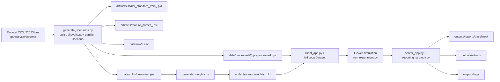
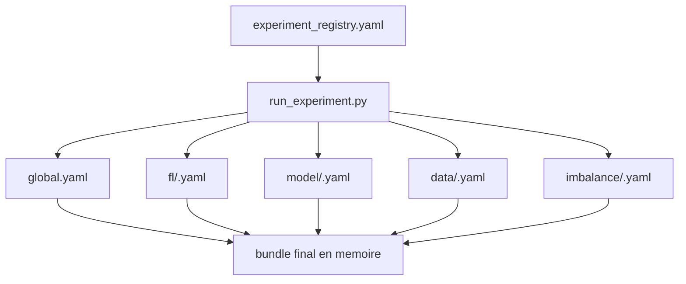
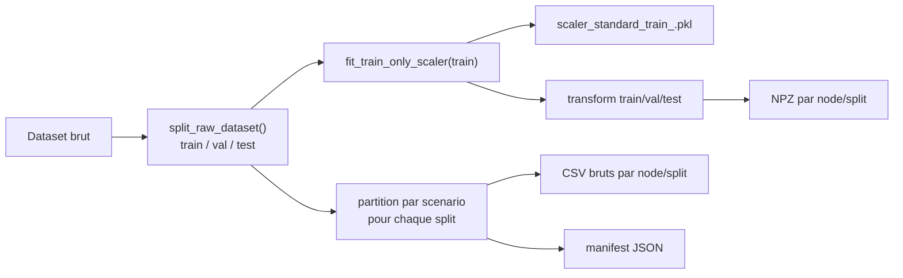
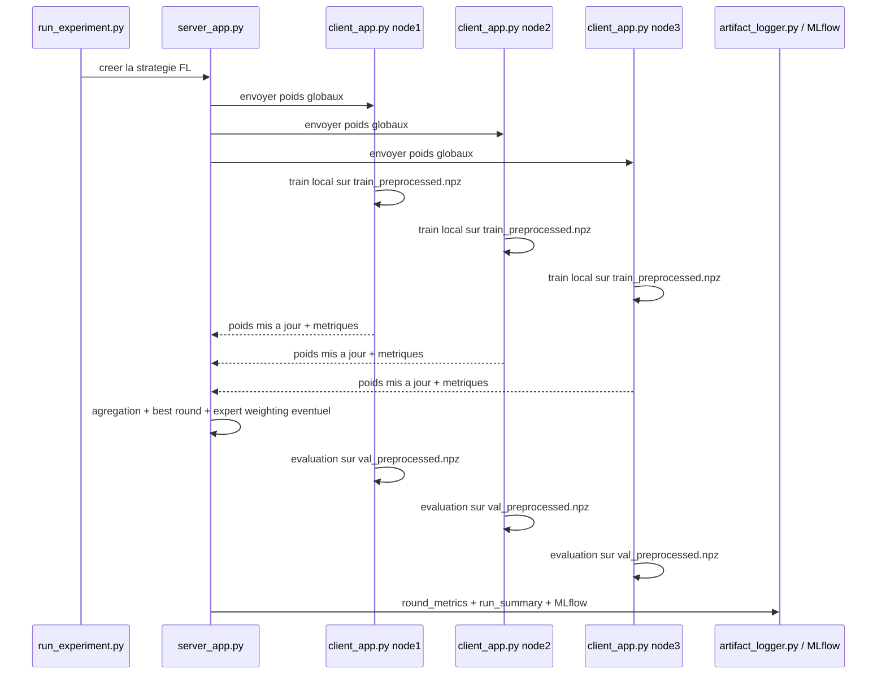

# Repository Map - qi-fl-ids-iot

## 1. Vue globale

Ce depot contient 4 generations du projet. La stack a privilegier pour comprendre le systeme final est:

```text
experiments/fl-iot-ids-v3
```

Carte rapide du repository:

```text
qi-fl-ids-iot/
|-- data/                         # donnees globales partagees au niveau racine
|-- docs/                         # documentation racine
|-- experiments/
|   |-- baseline-CIC_IOT_2023/   # baseline centralisee
|   |-- fl-iot-ids-v1/           # premiere version FL
|   |-- fl-iot-ids-v2/           # couche intermediaire / exploration
|   `-- fl-iot-ids-v3/           # stack finale retenue
|-- outputs/                     # sorties racine
|-- shared/                      # ressources partagees
|-- README.md                    # cadrage global du projet
`-- environment.yml              # environnement Conda racine
```

Role des grandes zones:

| Zone | Role |
|---|---|
| `experiments/baseline-CIC_IOT_2023` | Baseline centralisee, notebooks, artefacts `.pkl`, datasets preprocesses `.npz`, figures. |
| `experiments/fl-iot-ids-v1` | Premiere implementation FL, utile comme historique. |
| `experiments/fl-iot-ids-v2` | Version intermediaire / exploratoire. |
| `experiments/fl-iot-ids-v3` | Version finale la plus propre, orientee experiences reproductibles + MLflow + reporting. |

## 2. La vraie map du systeme



Lecture simple:

1. On part du dataset global CICIoT2023.
2. On cree un scenario non-IID.
3. On sauvegarde les splits bruts CSV, puis les versions preprocesses `.npz`.
4. Les clients Flower lisent les `.npz`.
5. Le serveur agrege les updates et envoie les metriques/artifacts vers `reports` et `mlruns`.

## 3. Les inputs du systeme

### 3.1 Input de donnees principal

Le point d'entree data "reel" est defini dans `experiments/fl-iot-ids-v3/src/common/paths.py`.

- Source prioritaire: `E:/dataset/CICIoT2023/balancing_v3_fixed300k_outputs/balancing_v3_fixed300k_balanced.parquet`
- Fallback: meme dataset en CSV
- Colonne label attendue: `label_id`
- Nombre de features attendu: `28`
- Nombre de classes globales: `34`
- Classe benigne: `1`

### 3.2 Ce que le modele consomme vraiment

Le modele ne lit pas directement le CSV brut pendant l'entrainement FL.

Il consomme:

- `data/processed/<scenario>/<node>/train_preprocessed.npz`
- `data/processed/<scenario>/<node>/val_preprocessed.npz`

Le `test_preprocessed.npz` est genere par le nouveau pipeline, mais dans la stack actuelle il n'est pas encore consomme par `src/data/dataloader.py`, qui charge `train` + `val`.

## 4. Comment les configurations sont composees

Le systeme n'a pas une seule config monolithique. Il assemble plusieurs YAML.



Ordre de fusion reel:

1. `configs/global.yaml`
2. `configs/fl/<...>.yaml`
3. `configs/model/<...>.yaml`
4. `configs/data/<...>.yaml`
5. `configs/imbalance/<...>.yaml`
6. optionnellement `configs/nodes/<...>.yaml`

Le registre `configs/experiment_registry.yaml` donne juste les noms des briques a fusionner.

Exemple:

```text
exp_v3_fedavg_normal_classweights
= flat_34
+ fedavg
+ normal_noniid
+ class_weights
```

## 5. Le pipeline de donnees

### 5.1 Pipeline principal actuel

Le vrai pipeline moderne est dans `src/scripts/generate_scenarios.py`.



Regles importantes:

- Le split `train/val/test` se fait avant le scaling.
- Le scaler est fitte seulement sur `train`.
- `val` et `test` reutilisent ce scaler sans refit.
- Un `__row_id` est ajoute pour verifier que les splits sont disjoints.

Ce point est important: le depot essaye d'eviter la fuite d'information (data leakage).

### 5.2 Pipeline legacy encore present

Il existe aussi une chaine plus ancienne:

- `src/scripts/fit_global_scaler.py`
- `src/scripts/preprocess_node_data.py`
- `src/scripts/prepare_partitions.py`
- `src/data/preprocessor.py`

Cette chaine:

- fitte un scaler global plus ancien,
- preprocess un node a la fois,
- utilise des artefacts globaux `feature_names.pkl`, `scaler_standard_global.pkl`,
- garde de la compatibilite avec d'anciens artefacts baseline.

Conclusion pratique:

- `generate_scenarios.py` = pipeline principal v3 moderne
- `fit_global_scaler.py` / `preprocess_node_data.py` / `prepare_partitions.py` = pipeline support / legacy

## 6. Les partitions et scenarios

### 6.1 `normal_noniid`

Fichier: `configs/data/normal_noniid.yaml`

Idee:

- partition Dirichlet (`alpha=0.5`)
- heterogeneite moderee
- la classe benigne est extraite puis redistribuee equitablement entre les 3 nodes

Effet:

- tous les nodes voient du trafic benign,
- les attaques sont reparties differemment selon le tirage Dirichlet.

### 6.2 `absent_local`

Fichier: `configs/data/absent_local.yaml`

Idee:

- partition plus heterogene (`alpha=0.3`)
- certaines classes sont supprimees localement de certains clients
- la classe benigne n'est jamais retiree

Effet:

- on simule des clients aveugles a certaines attaques,
- utile pour tester FedProx et la robustesse au drift.

### 6.3 `rare_expert`

Fichier: `configs/data/rare_expert.yaml`

Idee:

- `node3` devient client expert,
- `node1` et `node2` recoivent les classes "normales",
- `node3` concentre les classes rares / expertes,
- le serveur peut appliquer un `expert_factor` pour sur-ponderer `node3`.

Effet:

- on simule une expertise locale specialisee,
- utile pour etudier le rappel des classes rares.

## 7. Preprocessing et scaler

### 7.1 Ce que contient le preprocessing

Les `.npz` generes contiennent:

- `X`: matrice des features scalees, type `float32`
- `y`: labels entiers, type `int64`
- `feature_names`: ordre des 28 features

Exemple observe dans le depot:

- `X_shape = (1896684, 28)` pour `normal_noniid/node1/train`
- `y_shape = (1896684,)`
- `feature_names` commence par `flow_duration`, `Header_Length`, `Protocol Type`, `Duration`, `Rate`

### 7.2 Role du scaler

Le scaler standardise les 28 features numeriques.

Types de scaler presents:

| Fichier | Role | Etat |
|---|---|---|
| `scaler_standard_train_<scenario>.pkl` | scaler principal du pipeline split-aware moderne | coeur |
| `scaler_standard_global.pkl` | ancien scaler global | support / legacy |
| `scaler_robust_global.pkl` | ancien `RobustScaler` | legacy |
| `scaler_robust_node*.pkl` | anciens scalers par node | legacy |

Important:

- Le client FL ne scale pas en ligne.
- Le scaling se fait avant l'entrainement.
- Le client lit des donnees deja pretes dans les `.npz`.

## 8. A quoi servent les fichiers `.pkl`

Les `.pkl` servent a sauvegarder des objets Python utiles au pipeline.

### 8.1 `.pkl` utiles au pipeline v3 actuel

| Fichier | Contenu | Utilisation |
|---|---|---|
| `feature_names_<scenario>.pkl` | liste des 28 noms de features | tracabilite / reproductibilite |
| `scaler_standard_train_<scenario>.pkl` | `StandardScaler` fitte sur train | preuve du preprocessing |
| `class_weights_<scenario>.pkl` | `numpy.ndarray` de taille 34 | pertes ponderees |
| `scaffold_c_global.pkl` | control variate serveur SCAFFOLD | synchro SCAFFOLD |
| `scaffold_c_local_node*.pkl` | control variate locale client | synchro SCAFFOLD |

Observation concrete:

- `class_weights_normal_noniid.pkl` est un `ndarray (34,)`, `float32`, moyenne `1.0`.

### 8.2 `.pkl` legacy / baseline

| Fichier | Role |
|---|---|
| `feature_names.pkl` | ancien fichier global de noms de features |
| `class_weights_34.pkl` | ancien poids globaux, pas le chemin principal actuel |
| `artifacts/baseline/.../label_mapping_34.pkl` | mapping labels texte vers ids, heritage baseline |
| `src/data/preprocessor.py` | adaptateur baseline qui s'appuie sur ces anciens artefacts |

## 9. A quoi servent les fichiers `.npz`

Les `.npz` sont centraux: ce sont les datasets prets a l'entrainement.

Role exact:

1. `generate_scenarios.py` transforme les CSV bruts de chaque node en `.npz`.
2. `src/data/dataset.py` charge ces `.npz`.
3. `src/data/dataloader.py` construit les `DataLoader` PyTorch.
4. `src/fl/client_app.py` lit ces `DataLoader` pendant `fit()` et `evaluate()`.

Donc:

- les `.npz` participent directement a l'entrainement,
- ils sont le format local de travail du client FL,
- ils evitent de reparser le CSV brut a chaque round.

Structure attendue:

```python
{
  "X": float32[n_samples, 28],
  "y": int64[n_samples],
  "feature_names": object[28]
}
```

## 10. Le modele

Le code du modele est dans `src/model/network.py`.

### 10.1 Architecture principale reelle

Le vrai modele principal est pilote par `configs/model/flat_34.yaml`:

```text
Input 28
-> Linear(28, 256)
-> ReLU
-> Dropout(0.2)
-> Linear(256, 128)
-> ReLU
-> Dropout(0.2)
-> Linear(128, 34)
```

Nombre de parametres: `44,706`

### 10.2 Variante alternative

`configs/model/flat_34_v1style.yaml`:

```text
28 -> 128 -> 64 -> 34
```

Nombre de parametres: `14,178`

### 10.3 Pertes

Dans `src/model/losses.py`:

- `class_weights` -> `CrossEntropyLoss(weight=...)`
- `focal_loss` -> `FocalLoss(gamma=...)`
- `focal_loss_weighted` -> `FocalLoss` + poids de classes

### 10.4 Validation du modele

`src/model/validation.py` force une regle importante:

- l'espace de sortie doit toujours rester global a `34` classes,
- meme si un client local ne voit qu'un sous-ensemble des classes.

C'est un point cle du FL non-IID.

## 11. Comment fonctionne l'architecture FL

### 11.1 Chemin principal actuel

Le vrai point d'entree moderne est:

```text
src/scripts/run_experiment.py
```

Ce script:

1. lit le registre d'experiences,
2. fusionne les configs,
3. cree `server_app`,
4. cree `client_app`,
5. lance une simulation Flower via Ray,
6. enregistre les metrics et artifacts.

### 11.2 Composants FL

| Fichier | Role |
|---|---|
| `src/fl/client_app.py` | client Flower moderne pour la simulation |
| `src/fl/server_app.py` | serveur Flower moderne pour la simulation |
| `src/fl/reporting_strategy.py` | strategies FedAvg/SCAFFOLD avec tracking, best round et expert weighting |
| `src/fl/aggregation_hooks.py` | regles d'agregation des metriques |
| `src/scripts/run_experiment.py` | orchestrateur principal actuel |
| `src/scripts/run_server.py` | ancien lanceur manuel, encore utile pour reference |
| `src/scripts/run_client.py` | ancien client manuel, encore utile pour reference |

### 11.3 Cycle d'un round



### 11.4 FedAvg

Implante cote serveur par `ReportingFedAvg`.

Principe:

- moyenne ponderee par `num_examples`
- option: sur-ponderer `node3` avec `expert_factor`

### 11.5 FedProx

Implante cote client dans `client_app.py`.

Principe:

- meme logique que FedAvg
- mais la loss locale ajoute un terme proximal vers le modele global

Forme:

```text
loss = ce_loss + (mu / 2) * ||w_local - w_global||^2
```

### 11.6 SCAFFOLD

Implante des deux cotes:

- serveur: `ReportingScaffold`
- client: `FlowerClient._train_scaffold_epoch`

Principe:

- le serveur maintient `c_global`
- chaque client maintient `c_local`
- le client renvoie `scaffold_delta_c`
- le serveur met a jour `c_global`

Artefacts associes:

- `scaffold_c_global.pkl`
- `scaffold_c_local_node1.pkl`
- `scaffold_c_local_node2.pkl`
- `scaffold_c_local_node3.pkl`

## 12. Les metrics

### 12.1 Metrics locales calculees par le client

Dans `src/model/evaluate.py`:

- `loss`
- `accuracy`
- `macro_f1`
- `precision_macro`
- `recall_macro`
- `benign_recall`
- `false_positive_rate = 1 - benign_recall`
- `rare_class_recall`
- `tp_class_*`, `fp_class_*`, `fn_class_*`

### 12.2 Pourquoi les TP/FP/FN par classe sont importants

Le serveur ne se contente pas de faire une moyenne naive des metrics rares.

Dans `src/fl/aggregation_hooks.py`:

- il somme les `tp/fp/fn` globaux,
- puis il recalcule `macro_f1`, `recall_macro`, `rare_class_recall`, `rare_macro_f1`.

Ca evite de biaiser les metriques rares quand les clients ont des supports tres differents.

### 12.3 Agregation des metrics de fit

Toujours dans `aggregation_hooks.py`:

- `train_loss_last` -> moyenne ponderee par `num_examples`
- `train_time_sec` -> somme
- `update_size_bytes` -> somme

Donc `update_size_bytes` dans `round_metrics.json` correspond au cout total du round, pas au cout d'un seul client.

Exemple concret:

- taille de mise a jour par client pour le modele `flat_34`: environ `178,824` bytes
- somme sur 3 clients: `536,472` bytes

## 13. Les outputs et comment les utiliser

### 13.1 Outputs principaux

| Dossier / fichier | Utilisation |
|---|---|
| `outputs/logs/*.log` | debug technique du pipeline |
| `outputs/mlruns/` | backend MLflow local |
| `outputs/reports/baselines/<experiment>/run_summary.json` | resultat final compact |
| `outputs/reports/baselines/<experiment>/round_metrics.json` | courbes round par round |
| `outputs/reports/baselines/<experiment>/resolved_config.json` | config exacte pour reproduire |
| `outputs/reports/baselines/<experiment>/baseline_notes.md` | note de synthese generee |
| `outputs/reports/fl_v3_ablation_table.csv` | tableau comparatif exporte |
| `outputs/reports/fl_v3_ablation_table.md` | meme tableau en Markdown |
| `outputs/reports/*.html` | rendus legers pour presentation |

### 13.2 Comment les lire

Si tu veux:

- comparer les experiences -> lis `fl_v3_ablation_table.csv` ou les `run_summary.json`
- comprendre la dynamique d'apprentissage -> lis `round_metrics.json`
- reproduire exactement un run -> lis `resolved_config.json`
- faire une soutenance / rapport -> utilise les HTML et le Markdown

### 13.3 Ce que `run_summary.json` apporte

Exemple de contenu:

- statut du run
- duree
- nombre de rounds completes
- meilleure round
- `final_accuracy`
- `final_macro_f1`
- `final_benign_recall`
- `final_false_positive_rate`
- `final_rare_class_recall`

## 14. Role des fichiers importants

### 14.1 Racine

| Fichier / dossier | Role | Etat |
|---|---|---|
| `README.md` | vue globale du projet et de l'evolution v1/v2/v3 | documentation |
| `environment.yml` | env Conda racine | support |
| `docs/` | documentation racine | support |
| `experiments/` | coeur scientifique du depot | coeur |

### 14.2 `experiments/fl-iot-ids-v3/configs`

| Fichier | Role | Etat |
|---|---|---|
| `global.yaml` | constantes globales dataset/artifacts/mlflow | coeur |
| `experiment_registry.yaml` | catalogue d'experiences nommees | coeur |
| `fl/*.yaml` | hyperparametres FL par strategie | coeur |
| `model/*.yaml` | architectures de modele | coeur |
| `data/*.yaml` | definition des scenarios | coeur |
| `imbalance/*.yaml` | strategie de gestion du desequilibre | coeur |
| `nodes/*.yaml` | anciens chemins par node | support |

### 14.3 `experiments/fl-iot-ids-v3/src/common`

| Fichier | Role | Etat |
|---|---|---|
| `paths.py` | chemins racine, dataset externe, outputs, helpers de paths | coeur |
| `config.py` | chargement YAML et fusion profonde | coeur |
| `registry.py` | lecture du registre d'experiences | coeur |
| `logger.py` | logging console + fichier rotatif | coeur |
| `utils.py` | seed, liste des nodes, mapping partition-id -> node id | coeur |
| `schemas.py` | petit dataclass `NodeConfig` | support |

### 14.4 `experiments/fl-iot-ids-v3/src/data`

| Fichier | Role | Etat |
|---|---|---|
| `dataset.py` | charge un `.npz` en `Dataset` PyTorch | coeur |
| `dataloader.py` | cree les `DataLoader` et exige `train` + `val` | coeur |
| `preprocessor.py` | adaptateur baseline avec label mapping / scaler legacy | legacy |
| `collector.py` | mini helper de listing de fichiers bruts | support |
| `partitioning.py` | helper minimal pour ecrire un manifest | support |

### 14.5 `experiments/fl-iot-ids-v3/src/model`

| Fichier | Role | Etat |
|---|---|---|
| `network.py` | definition du MLP | coeur |
| `losses.py` | chargement poids de classes + focal loss | coeur |
| `train.py` | boucle locale d'entrainement standard | coeur |
| `evaluate.py` | calcul des metriques locales | coeur |
| `validation.py` | verifie la coherence du nombre de classes | coeur |

### 14.6 `experiments/fl-iot-ids-v3/src/fl`

| Fichier | Role | Etat |
|---|---|---|
| `client_app.py` | client Flower moderne pour simulation | coeur |
| `server_app.py` | serveur Flower moderne pour simulation | coeur |
| `reporting_strategy.py` | FedAvg/SCAFFOLD avec tracking et best round | coeur |
| `aggregation_hooks.py` | aggregation correcte des metriques de fit/eval | coeur |
| `metrics.py` | helper simple historique | support |
| `strategy.py` | ancienne factory de strategie simple | support |

### 14.7 `experiments/fl-iot-ids-v3/src/scripts`

| Fichier | Role | Etat |
|---|---|---|
| `run_experiment.py` | orchestrateur principal actuel | coeur |
| `generate_scenarios.py` | pipeline data principal moderne | coeur |
| `generate_weights.py` | cree `class_weights_<scenario>.pkl` | coeur |
| `build_ablation_table.py` | compile les resultats en CSV/MD | coeur |
| `fit_global_scaler.py` | ancien scaler global support | legacy |
| `preprocess_node_data.py` | ancien preprocess unitaire par node | legacy |
| `prepare_partitions.py` | ancien partitionneur train-only | legacy |
| `run_server.py` | ancien serveur manuel | support / legacy |
| `run_client.py` | ancien client manuel | support / legacy |
| `validate_data_pipeline.py` | verifications rapides sur les `.npz` | support |
| `smoke_test.py` | smoke test minimal | test |
| `test_dataloader.py` | script de test ponctuel | test |
| `test_local_training.py` | test local ponctuel | test |

### 14.8 `experiments/fl-iot-ids-v3/src/tracking` et `src/utils`

| Fichier | Role | Etat |
|---|---|---|
| `tracking/artifact_logger.py` | ecrit `run_summary.json`, `round_metrics.json`, `baseline_notes.md` | coeur |
| `tracking/run_naming.py` | normalise noms MLflow/run | coeur |
| `utils/mlflow_logger.py` | wrapper MLflow portable Windows/POSIX | coeur |

### 14.9 `experiments/fl-iot-ids-v3/tests`

| Fichier | Role |
|---|---|
| `test_preprocessor.py` | garantit split raw avant scaling |
| `test_fl_invariants.py` | garantit output global a 34 classes et differences FedAvg/FedProx/SCAFFOLD |
| `test_model.py` | garantit aggregation correcte des metriques |
| `test_tracking.py` | garantit export MLflow/tracker |

### 14.10 `experiments/fl-iot-ids-v3/src/services`

Ces fichiers sont des squelettes:

- `collector_service.py`
- `fl_client_service.py`
- `preprocessor_service.py`

Ils n'orchestrent pas le pipeline actuel. Ils semblent reserves a une future execution "service" ou daemonisee.

## 15. Etat reel du depot aujourd'hui

Le plus important pour ne pas se tromper:

### 15.1 Ce qui est clairement stable

- `normal_noniid` est aligne avec le nouveau pipeline split-aware.
- `absent_local` est aligne avec le nouveau pipeline split-aware.
- `run_experiment.py` + `client_app.py` + `server_app.py` est la chaine moderne la plus propre.
- les rapports succes actuels existent surtout pour `normal_noniid` et `absent_local`.

### 15.2 Ce qui est encore hybride / legacy

- `fit_global_scaler.py`, `prepare_partitions.py`, `preprocess_node_data.py` coexistent avec `generate_scenarios.py`.
- `src/data/preprocessor.py` depend d'un `label_mapping_34.pkl` legacy qui n'est pas le chemin principal de la stack moderne.
- `run_server.py` / `run_client.py` coexistent avec `run_experiment.py`.

### 15.3 Point d'attention important: `rare_expert`

Dans l'etat actuel du worktree:

- `data/processed/rare_expert/node*/` contient seulement `train_preprocessed.npz`
- il manque les `val_preprocessed.npz` / `test_preprocessed.npz`
- `artifacts/class_weights_rare_expert.pkl` est absent
- `artifacts/scaler_standard_train_rare_expert.pkl` est absent
- `outputs/reports/baselines/` ne montre pas de run `rare_expert` reussi

Inference technique:

- `generate_weights.py` attend un manifest avec `splits.train.nodes`
- `dataloader.py` exige `train_preprocessed.npz` ET `val_preprocessed.npz`

Donc `rare_expert` est bien defini dans le code et dans le registre, mais il n'est pas totalement materialise dans les artefacts du depot au format moderne.

### 15.4 Autre point d'attention: doc vs code

La documentation textuelle du depot n'est pas 100% synchrone avec le code.

Exemples:

- la doc parle parfois du MLP `28 -> 128 -> 64 -> 34` comme modele principal,
- mais le registre principal utilise souvent `flat_34 = 28 -> 256 -> 128 -> 34`,
- certains chemins d'artefacts globaux historiques existent encore alors que le pipeline moderne prefere les artefacts scenario-specifiques.

## 16. Resume ultra-court

Si tu veux retenir l'essentiel:

1. Le systeme final est `experiments/fl-iot-ids-v3`.
2. Le vrai format d'entrainement est le `.npz`, pas le CSV brut.
3. Le vrai orchestration moderne est `run_experiment.py`, pas seulement `run_server.py`.
4. Les configs sont assemblees par couches via `experiment_registry.yaml`.
5. Les `.pkl` sauvegardent scaler, features, class weights et etat SCAFFOLD.
6. Les metrics finales utiles sont dans `outputs/reports/baselines/<exp>/run_summary.json`.
7. `rare_expert` existe dans le code mais n'est pas encore completement aligne avec le nouveau contrat data dans le depot courant.
