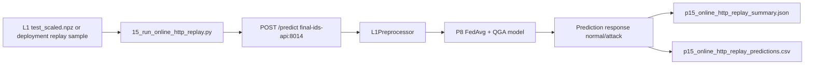
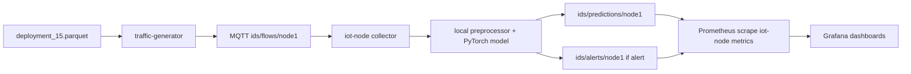
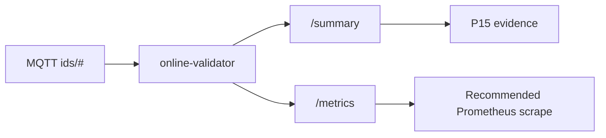

# Online Deployment and Grafana Dashboard Audit

Date: 2026-05-24

Scope:

- `services/`
- `experiments/qi-fl-ids-iot-final/`

No offensive tooling was run. This audit is based on static inspection of Docker Compose files, FastAPI services, MQTT collectors, Prometheus configuration, Grafana dashboards, final deployment artifacts, and P15 replay/validation scripts.

## Executive Summary

The repository contains two related deployment paths:

1. **Final P14/P15 deployment path**: `final-ids-api` serves the final L1 binary model, `P8 FedAvg + QGA`, over HTTP. This is the scientifically aligned production model. It expects scaled features and supports either 12 selected QGA features or 28 scaled original L1 features. P15 adds safe HTTP replay, MQTT observation, and the new `final-mqtt-bridge`.
2. **Legacy/operational MQTT path**: `traffic-generator` publishes replayed flows to MQTT topics, and `iot-node` consumes `ids/flows/{node_id}` to publish predictions and alerts. This path is operationally complete, but it uses the older deployment bundle from `experiments/fl-iot-ids-v3`, not the final P8 FedAvg + QGA binary model.

The key gap found by the audit was a **bridge from MQTT replay flows to the final P8 HTTP API**. That gap is now addressed by `final-mqtt-bridge`, which consumes `ids/flows/#`, calls `final-ids-api /predict`, and publishes final binary predictions and alerts to `ids/predictions/#` and `ids/alerts/#`.

## Audited Runtime Components

### P15 Final MQTT Bridge Update

Path: `experiments/qi-fl-ids-iot-final/deployment/final_mqtt_bridge/`

Role:

- Subscribes to `ids/flows/#`.
- Extracts `node_id`, `flow_id`, and scaled feature vectors.
- Calls `final-ids-api /predict`.
- Publishes final predictions to `ids/predictions/{node_id}`.
- Publishes final alerts to `ids/alerts/{node_id}` when the final API predicts attack.
- Exposes `/health`, `/ready`, and `/metrics` on port `8016`.

Runtime metrics:

- `final_mqtt_bridge_ready`
- `final_mqtt_bridge_mqtt_connected`
- `final_mqtt_bridge_flows_received_total`
- `final_mqtt_bridge_predictions_published_total`
- `final_mqtt_bridge_alerts_published_total`
- `final_mqtt_bridge_prediction_errors_total`
- `final_mqtt_bridge_http_latency_seconds`
- `final_mqtt_bridge_last_message_timestamp_seconds`

This bridge keeps the final scientific inference model in `final-ids-api` and only adds an operational adapter between safe MQTT replay and the final HTTP API.

### Docker Compose Files

`services/docker-compose.yml` defines the historical microservice stack:

- `mosquitto`
- `iot-node-1`, `iot-node-2`, `iot-node-3`, optional `iot-node-4`, `iot-node-5`
- `traffic-generator`
- `feature-extractor`
- `prometheus`
- `grafana`
- `mlflow`
- `fl-server`
- `dashboard`
- optional profiles: `training`, `demo-data`, `orchestration`, `preprocessing`, `extraction`, `gateway`, `extended`

`experiments/qi-fl-ids-iot-final/deployment/docker-compose.final.yml` defines the final isolated delivery stack:

- `mosquitto`
- `final-ids-api`
- `dashboard-p13`
- optional `traffic-generator` under profile `demo`
- optional `online-validator` under profile `online`
- optional `final-mqtt-bridge` under profile `online`
- `prometheus`
- `grafana`

The final compose intentionally does not modify the historical `services/docker-compose.yml`.

### Traffic Generator

Path: `services/traffic-generator/`

Runtime behavior:

- Loads a parquet replay scenario such as `deployment_15.parquet`.
- Loads the canonical feature order from `/artifacts/feature_names.pkl`.
- Publishes each replay row to MQTT.
- Supports single-node or round-robin target distribution.

Published topic:

- `ids/flows/{target_node_id}`

Status topic:

- `ids/status/{NODE_ID}`

Payload fields:

- `schema_version`
- `event_type`
- `flow_id`
- `node_id`
- `scenario`
- `timestamp`
- `features`
- optional `ground_truth_label_id`

Health/ready/metrics:

- `GET /health`
- `GET /ready`
- `GET /metrics`

Prometheus metrics:

- `traffic_generator_status`
- `traffic_generator_flows_published_total`
- `traffic_generator_flows_published_by_target_total`
- `traffic_generator_rows_skipped_total`
- `traffic_generator_mqtt_connected`

### IoT Node / IDS MQTT Inference Service

Path: `services/iot-node/`

Runtime behavior:

- Subscribes to `ids/flows/{NODE_ID}`.
- Validates the flow message.
- Applies preprocessing/scaling using the mounted artifact bundle.
- Runs local PyTorch inference.
- Publishes prediction messages.
- Publishes alert messages when confidence crosses the threshold and the predicted label is not benign.

Subscribed topic:

- `ids/flows/{NODE_ID}`

Published topics:

- `ids/predictions/{NODE_ID}`
- `ids/alerts/{NODE_ID}`
- `ids/status/{NODE_ID}`

Prediction message:

```json
{
  "schema_version": "1.0",
  "event_type": "ids_prediction",
  "node_id": "node1",
  "timestamp": "...",
  "flow_id": "...",
  "predicted_label": "...",
  "predicted_label_id": 1,
  "confidence": 0.99,
  "is_alert": true,
  "model_version": "baseline_fedavg_normal_classweights"
}
```

Alert message:

```json
{
  "schema_version": "1.0",
  "event_type": "ids_alert",
  "node_id": "node1",
  "timestamp": "...",
  "flow_id": "...",
  "predicted_label": "...",
  "predicted_label_id": 1,
  "confidence": 0.99,
  "severity": "critical",
  "source_topic": "ids/flows/node1",
  "model_version": "baseline_fedavg_normal_classweights"
}
```

Health/ready/metrics:

- `GET /health`
- `GET /ready`
- `GET /metrics`

Prometheus metrics:

- `ids_flows_received_total`
- `ids_flows_rejected_invalid_schema_total`
- `ids_predictions_total`
- `ids_alerts_total`
- `inference_latency_seconds`
- `ids_node_status`
- `ids_node_assigned_tier_info`

### Final IDS API

Path: `experiments/qi-fl-ids-iot-final/deployment/final_ids_api/`

Runtime behavior:

- Loads the final deployment bundle from `deployment/l1_final`.
- Serves the final `P8 FedAvg + QGA` model.
- Uses `selected_mask_id=conservative_seed_42`.
- Accepts 12 selected scaled features or 28 original scaled features.
- Returns binary `normal`/`attack` predictions.

Endpoints:

- `GET /health`
- `GET /ready`
- `GET /metrics`
- `GET /model/info`
- `POST /predict`
- `POST /predict/batch`

Prometheus metrics:

- `final_ids_api_ready`
- `final_ids_api_predictions_total`
- `final_ids_api_prediction_errors_total`
- `final_ids_api_uptime_seconds`

Important limitation:

- The final IDS API does not currently subscribe to MQTT and does not publish `ids/predictions/#` or `ids/alerts/#`.

### Mosquitto MQTT

Path: `services/mosquitto/`

Configuration:

- Listener: `1883`
- Anonymous access disabled.
- Password file mounted from `services/mosquitto/passwords`.
- Persistence disabled for demo/runtime validation.

### Prometheus

Historical stack config:

- `services/monitoring/prometheus.yml`

Scrapes:

- `iot-node-1:8000`
- `iot-node-2:8000`
- `iot-node-3:8000`
- optional node jobs for `iot-node-4`, `iot-node-5`
- `traffic-generator:8000`
- `feature-extractor:8000`
- `fl-server:8000`

Final stack config:

- `experiments/qi-fl-ids-iot-final/deployment/monitoring/prometheus.final.yml`

Scrapes:

- `final-ids-api:8014`
- `traffic-generator:8000`
- `online-validator:8015`

Note: `online-validator` is profile-gated. If the `online` profile is not active, this Prometheus target may appear down; that is expected unless P15 MQTT observation is being demonstrated.

## Final Artifacts and P15 Assets

Final deployment bundle:

- `experiments/qi-fl-ids-iot-final/deployment/l1_final/deployment_manifest.json`
- `experiments/qi-fl-ids-iot-final/deployment/l1_final/selected_model.json`
- `experiments/qi-fl-ids-iot-final/deployment/l1_final/feature_schema.json`
- `experiments/qi-fl-ids-iot-final/deployment/l1_final/artifacts/model.pth`
- `experiments/qi-fl-ids-iot-final/deployment/l1_final/artifacts/selected_features.json`
- `experiments/qi-fl-ids-iot-final/deployment/l1_final/artifacts/qga_feature_mask.json`

Final selected model:

- Method: `P8 FedAvg + QGA`
- Task: L1 binary IDS
- Input dimension: 12
- Original feature count: 28
- Selected mask: `conservative_seed_42`
- Threshold: `0.4`
- Labels: `normal=0`, `attack=1`

P15 scripts:

- `15_run_online_http_replay.py`
- `15_check_mqtt_topics.py`
- `15_collect_online_evidence.py`

P15 reports already present:

- `p15_online_replay_audit.md`
- `p15_online_replay_plan.md`
- local runtime evidence files may exist if the evidence collector was run.

No P15 figure folder was found. Existing relevant figures come from P10 robustness, P12 ablation, QGA/QIFA, and dashboard reports.

## Flow Architecture

### Final HTTP Replay Path



This path is aligned with the final model decision. It measures online HTTP behavior but does not publish MQTT predictions or alerts.

### Historical MQTT Replay Path



This path is operationally complete but tied to historical deployment artifacts, not the final P8 FedAvg + QGA binary API.

### P15 MQTT Observation Path



## Grafana Dashboard Inventory

Existing dashboards in `services/monitoring/grafana/dashboards/`:

| File | Title | Panels |
|---|---|---:|
| `01_ids_overview.json` | IDS Overview | 6 |
| `02_traffic_generator.json` | Traffic Generator | 5 |
| `03_inference_performance.json` | Inference Performance | 5 |
| `04_alerts_predictions.json` | Alerts & Predictions | 5 |
| `05_fl_server.json` | D2 — FL Training Health | 10 |
| `06_feature_extractor.json` | Feature Extractor | 5 |
| `07_network_security.json` | D1 — IDS Network Security | 11 |
| `qi_fl_ids_overview.json` | QI-FL-IDS Overview | 8 |

## Existing Panels

### IDS Overview

- IoT Node Status
- Flow Ingress Rate
- Prediction Rate
- Alert Rate
- Pipeline Rates
- Invalid Schema Rejection Rate

### Traffic Generator

- Generator Status
- MQTT Connection
- Published Flow Rate
- Skipped Row Rate
- Replay Throughput

### Inference Performance

- Inference Throughput
- Mean Inference Latency
- P95 Latency
- Throughput Over Time
- Latency Over Time

### Alerts & Predictions

- Alert Ratio
- Rejected Flow Ratio
- Total Alert Rate
- Predictions By Label
- Alerts By Severity

### FL Training Health

- Round FL Actuel
- Accuracy Globale Modèle
- Benign Recall
- F1-Macro Score
- Clients Actifs
- Taux Faux Positifs
- Convergence FL
- Alertes IDS par Type d'Attaque
- Durée des Rounds FL
- Bande Passante Totale par Round

### Feature Extractor

- MQTT Connected
- Active Windows
- Vector Publish Rate
- Rejection Ratio
- Feature Extractor Pipeline — Rates

### IDS Network Security

- Nœuds IoT Actifs
- Benign Recall
- Attaques Détectées
- F1-Macro Score
- Taux Faux Positifs
- Alertes IDS — Timeline par Type d'Attaque
- Répartition Types d'Attaques
- Accuracy NODE_1
- Accuracy NODE_2
- Accuracy NODE_3
- Bande Passante — Transferts Modèles

### QI-FL-IDS Overview

- Nodes registered
- Active FL clients
- Current FL round
- F1-macro
- IDS predictions / sec by node
- IDS alerts / min by node
- Inference latency p95
- Nodes by tier

## Weak or Misleading Panels

- `Benign Recall`, `F1-Macro Score`, and `Taux Faux Positifs` appear in runtime dashboards but are FL/offline metrics, not live MQTT metrics.
- Panels using `attack_type` assume a label that `ids_alerts_total` does not emit. The current alert metric labels are `severity` and `predicted_label`.
- `Accuracy NODE_1/2/3` panels depend on `fl_node_accuracy`, which is not emitted by the online IDS inference services.
- `Round FL Actuel` and FL convergence panels are useful for training demos but not for final deployment validation screenshots.
- Final API metrics (`final_ids_api_*`) are not represented in existing Grafana dashboards.
- P15 online-validator metrics (`online_validator_*`) are not represented in existing Grafana dashboards.

## Missing Panels

High-value missing panels for report screenshots:

- Final API readiness: `final_ids_api_ready`
- Final API prediction throughput: `rate(final_ids_api_predictions_total[1m])`
- Final API prediction errors: `rate(final_ids_api_prediction_errors_total[1m])`
- Traffic replay to inference conversion ratio:
  `sum(rate(ids_predictions_total[1m])) / sum(rate(traffic_generator_flows_published_total[1m]))`
- Flow-to-alert ratio:
  `sum(rate(ids_alerts_total[1m])) / sum(rate(ids_flows_received_total[1m]))`
- Alerts by predicted label:
  `sum by (predicted_label) (rate(ids_alerts_total[1m]))`
- Online-validator observed topic family:
  `sum by (family) (rate(online_validator_messages_total[1m]))`
- Online-validator MQTT connection:
  `online_validator_mqtt_connected`
- Final P8 deployment model info is not a Prometheus metric yet; use dashboard text/annotation or P13 dashboard for that.

## Missing Alert Rules

Recommended alert rules:

- `FinalIDSApiDown`: `up{job="final-ids-api"} == 0` for 1 minute.
- `FinalIDSApiNotReady`: `final_ids_api_ready == 0` for 1 minute.
- `FinalIDSApiPredictionErrors`: `rate(final_ids_api_prediction_errors_total[5m]) > 0`.
- `TrafficGeneratorDown`: `traffic_generator_status == 0` for 1 minute.
- `TrafficGeneratorMqttDisconnected`: `traffic_generator_mqtt_connected == 0` for 1 minute.
- `NoFlowsPublished`: `sum(rate(traffic_generator_flows_published_total[5m])) == 0` while demo replay is expected.
- `NoPredictionsFromFlows`: `sum(rate(ids_flows_received_total[5m])) > 0 and sum(rate(ids_predictions_total[5m])) == 0`.
- `HighInvalidFlowRatio`: `sum(rate(ids_flows_rejected_invalid_schema_total[5m])) / clamp_min(sum(rate(ids_flows_received_total[5m])), 1) > 0.05`.
- `HighAlertRate`: `sum(rate(ids_alerts_total[5m])) > 1`.
- `HighInferenceLatencyP95`: `histogram_quantile(0.95, sum(rate(inference_latency_seconds_bucket[5m])) by (le)) > 0.1`.
- `OnlineValidatorDisconnected`: `online_validator_mqtt_connected == 0` for 1 minute when profile `online` is active.

## Recommended Dashboard Improvements

### Online IDS Operational Overview

Purpose: one screenshot showing that replay, inference, final API, and MQTT observation are alive.

Recommended panels:

- Final API readiness
- Final API predictions/sec
- Final API prediction error rate
- Traffic generator status
- Traffic generator published flows/sec
- MQTT connected state
- Pipeline flow/prediction/alert rates
- Online validator observed messages by family

### IDS Security View

Purpose: one screenshot showing what the IDS is detecting.

Recommended panels:

- Predictions by label
- Alerts by severity
- Alerts by predicted label
- Alert ratio
- Rejected flow ratio
- Inference p95 latency
- Top alert labels table

### Technical Observability

Purpose: one screenshot showing operational health, latency, and failure modes.

Recommended panels:

- Service `up` by job
- Final API readiness and errors
- IoT node MQTT status
- Traffic generator skipped rows
- Invalid schema ratio
- Inference latency mean/p95
- Online validator MQTT state
- Online validator topic counters

## Concrete PromQL Recommendations

```promql
final_ids_api_ready
```

```promql
rate(final_ids_api_predictions_total[1m])
```

```promql
rate(final_ids_api_prediction_errors_total[1m])
```

```promql
sum(rate(traffic_generator_flows_published_total[1m]))
```

```promql
max(traffic_generator_mqtt_connected)
```

```promql
sum(rate(ids_flows_received_total[1m]))
```

```promql
sum(rate(ids_predictions_total[1m]))
```

```promql
sum(rate(ids_alerts_total[1m]))
```

```promql
sum by (predicted_label) (rate(ids_predictions_total[1m]))
```

```promql
sum by (severity) (rate(ids_alerts_total[1m]))
```

```promql
sum by (predicted_label) (rate(ids_alerts_total[1m]))
```

```promql
sum(rate(ids_alerts_total[1m])) / clamp_min(sum(rate(ids_predictions_total[1m])), 1)
```

```promql
sum(rate(ids_flows_rejected_invalid_schema_total[1m])) / clamp_min(sum(rate(ids_flows_received_total[1m])), 1)
```

```promql
histogram_quantile(0.95, sum(rate(inference_latency_seconds_bucket[1m])) by (le))
```

```promql
sum by (family) (rate(online_validator_messages_total[1m]))
```

```promql
online_validator_mqtt_connected
```

## Final Recommendation

For the final year project report:

- Use P13 dashboard for scientific model comparison and final model selection.
- Use P14 final API evidence to show deployability of `P8 FedAvg + QGA`.
- Use P15 HTTP replay to show online behavior of the final model.
- Use MQTT/Grafana dashboards to show operational replay, topics, predictions, alerts, and observability.
- Explicitly state that the full MQTT prediction/alert path is currently mature for the historical `iot-node` stack, while the final P8 API path is HTTP-first until a final MQTT bridge is added.
